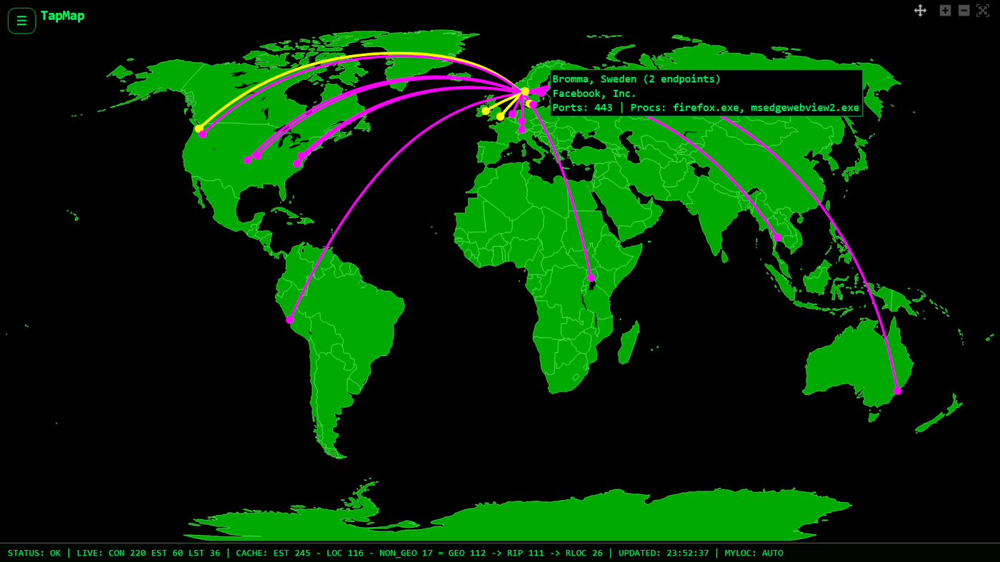
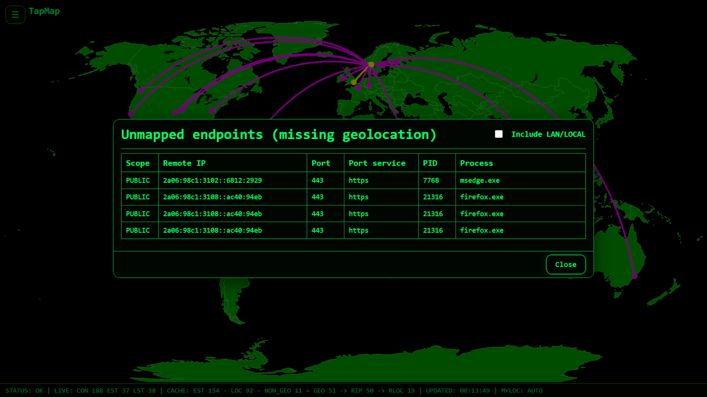
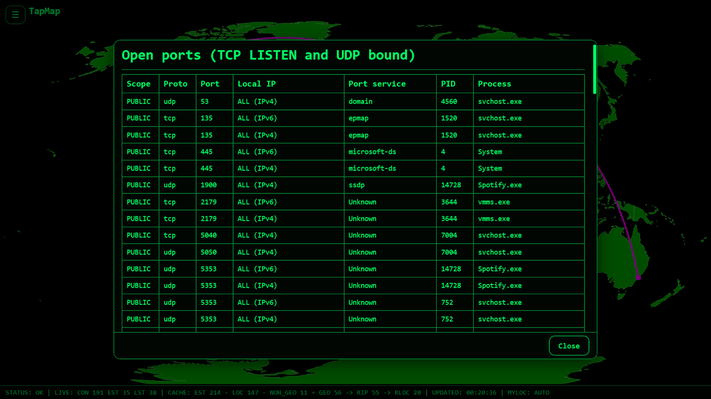

# TapMap

**See who your computer is connected to on a live world map.**

TapMap combines local socket inspection, IP geolocation, and interactive map visualization.

It uses:

- `psutil` to read active network connections
- MaxMind GeoLite2 databases for IP geolocation
- Dash and Plotly to render an interactive world map

Architecture: local socket scan → IP extraction → GeoIP lookup → map rendering.

TapMap runs entirely on your own machine.  
It is not a firewall or a full security suite.  
It makes network connections instantly visible on a world map and easy to inspect with hover and click.

---

## Download

Download the latest version from the  
[Releases page](https://github.com/olalie/tapmap/releases)

Available builds:

- Windows (zip)
- macOS (zip)
- Linux (zip)

No installation required. Download, extract, and run.

Tested on Windows 10/11, macOS, and Linux.

---

## Windows SmartScreen

Windows may show a SmartScreen warning the first time you run TapMap.  
This is normal for new applications that are not digitally signed.

To start the program:

1. Click **More info**.
2. Click **Run anyway**.

---

## How it runs

TapMap runs locally and opens in your browser.

The web interface runs on a local server at:

    http://127.0.0.1:8050/

If it does not open automatically, enter the address manually in your browser.

---

## GeoIP databases (required for map locations)

TapMap uses local MaxMind GeoLite2 databases for geolocation.  
The databases are not included in the download.

TapMap works without these files, but map locations will not be displayed.

Required files:

- GeoLite2-City.mmdb
- GeoLite2-ASN.mmdb

Download is free from MaxMind, but requires an account and acceptance of license terms:

    https://dev.maxmind.com/geoip/geolite2-free-geolocation-data

After downloading:

1. Start TapMap.
2. Open the **data folder** from the app.
3. Copy the `.mmdb` files into that folder.
4. Click **Recheck GeoIP databases**.

Update recommendation: download updated databases regularly, for example monthly.  
Redistribution is subject to the MaxMind license terms.

---

## What TapMap shows

- Remote endpoints your computer is connected to
- Approximate locations on a world map
- Nearby clusters highlighted visually
- Unmapped endpoints with missing geolocation
- Local open ports (TCP LISTEN and UDP bound)

All data is collected locally on your machine.

---

## Why TapMap

Most computers communicate with dozens of remote systems every day.  
You usually cannot see them.

TapMap makes these connections visible within seconds.

- See unexpected connections
- Understand where traffic goes
- Get a quick overview of network activity

Unexpected connections may indicate misconfiguration, background services, or unwanted software.

---

## Interface

### Main view

### Actions menu

### Unmapped endpoints

### Open ports

### About

---

## Keyboard controls

| Key | Action |
|-----|--------|
| U   | Unmapped endpoints |
| O   | Open ports |
| T   | Show cache in terminal |
| C   | Clear cache |
| R   | Recheck GeoIP databases |
| H   | Help |
| A   | About |
| ESC | Close window |

---

## Privacy

- TapMap runs locally.
- No connection data is sent anywhere.
- Geolocation uses local MaxMind databases.
- If `MY_LOCATION = "auto"`, TapMap makes a small request to detect your public IP.
- To detect offline status, TapMap performs short connection checks to 1.1.1.1 and 8.8.8.8.

---

## Configuration

TapMap reads settings from `config.py`.

Common settings:

- `MY_LOCATION`
- `POLL_INTERVAL_MS`
- `COORD_PRECISION`
- `ZOOM_NEAR_KM`

---

## Build from source

Requirements:

- Python 3.10+

Install dependencies:

    pip install -r requirements.txt

Run:

    python tapmap.py

---

## Support the project

TapMap is free and open source.

If you find it useful, consider supporting the project:

- Buy Me a Coffee  
  https://www.buymeacoffee.com/olalie  

- PayPal  
  https://www.paypal.com/donate/?hosted_button_id=ELLXBK9BY8EDU  

You can also give the project a star on GitHub.

---

## License

MIT License